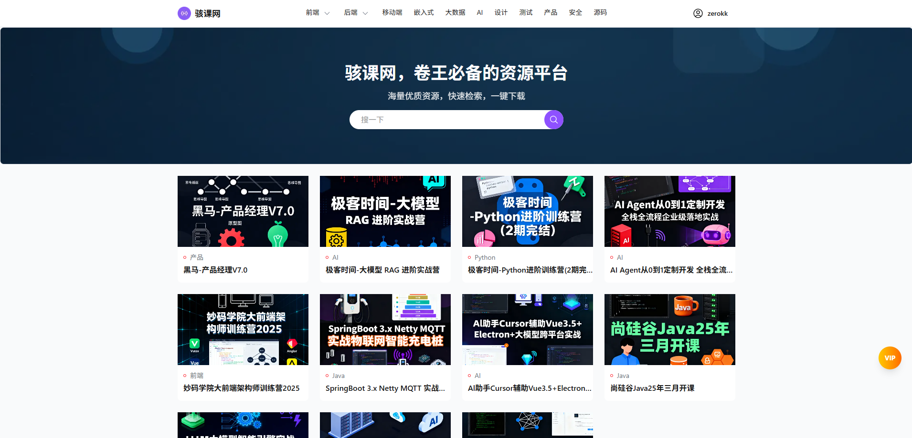

# 学好课（资源下载站）

基于 Next.js App Router 的资源下载站，包含前台、用户系统、支付（支付宝当面付）、管理后台与站点设置。

## 快速开始

- 安装依赖：`npm install`
- 开发启动：`npm run dev`（访问 `http://localhost:3000/`）
- 开发数据库同步：`npx prisma db push && npx prisma generate`
- 生产构建与启动：`npm run build && npm run start`

## 必需环境变量（.env）

- `DATABASE_URL`
- `ADMIN_JWT_SECRET`
- `SITE_JWT_SECRET`
- `ALIPAY_APP_ID`
- `ALIPAY_PRIVATE_KEY`（PKCS8）
- `ALIPAY_PUBLIC_KEY`
- `ALIPAY_GATEWAY`
- `ALIPAY_NOTIFY_URL`

## 主要功能

- 前台：首页、分类/子分类/标签、资源详情、个人中心、下载记录
- 后台：站点设置与支付配置
- 支付：预下单、查询、回调；支付成功自动发放访问授权

## 接口简要

- `GET /api/resources`、`GET /api/resources/[id]`
- `POST /api/pay/alipay/precreate`、`POST /api/pay/alipay/query`、`POST /api/pay/alipay/notify`

## 部署提示

- 确保数据库与 `.env` 配置完整；后台站点设置需完成品牌与支付配置。

## 部署教程
[部署教程](docs/deploy.md)
